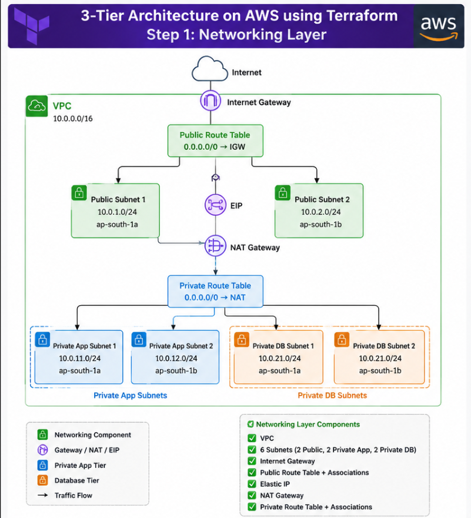

# 🚀 AWS 3-Tier Infrastructure with Terraform

This repository contains a Terraform-based AWS reference architecture for deploying a web application stack with networking, security, compute, load balancing, autoscaling, and observability in place.


---

## 📖 Overview

This project is designed to help readers understand how to provision a production-inspired AWS environment using Terraform modules. The current implementation focuses on the core layers required to run a web application securely and reliably:

- VPC and subnet design across multiple Availability Zones
- Public and private networking
- Security groups for ingress and egress control
- Application Load Balancers for frontend and backend traffic
- EC2 launch templates and Auto Scaling Groups
- CloudWatch alarms and SNS notifications for scaling and alerting

> The current codebase is a strong foundation for a web application stack. It does not yet provision a managed database layer such as RDS, though the network and security layout already supports that extension.

---

## 🏗 Architecture Snapshot



The architecture creates a layered environment where:

- Public resources are exposed through an external Application Load Balancer
- Private application instances run behind internal routing and health checks
- Traffic is segmented using security groups and subnet design
- Autoscaling and monitoring help the stack respond to changing load

---

## ✅ What This Repository Provisions

### Networking
- VPC with DNS support enabled
- Public subnets in two Availability Zones
- Private application subnets in two Availability Zones
- Database subnets for future database use
- Internet Gateway and NAT-related routing components

### Security
- ALB security group allowing HTTP/HTTPS from the internet
- Frontend security group allowing traffic only from the ALB
- Backend security group allowing traffic only from frontend instances
- Database security group for future backend-to-database access

### Compute
- Launch templates for frontend and backend EC2 instances
- Auto Scaling Groups with desired, minimum, and maximum capacities
- Target group integration for health-based scaling

### Load Balancing
- Public Application Load Balancer for frontend access
- Internal Application Load Balancer for backend traffic
- Target groups and listeners configured for HTTP

### Observability
- SNS topic for alerts
- Email subscription support via the configured alarm email
- CloudWatch alarms for CPU-based scale-up and scale-down actions

---

## 📁 Repository Structure

```text
.
├── backend.tf
├── dev.tfvars
├── dev.tfvars.example
├── main.tf
├── outputs.tf
├── provider.tf
├── variables.tf
├── version.tf
├── images/
├── modules/
│   ├── alb/
│   ├── compute/
│   ├── security/
│   └── vpc/
```

### Module responsibilities
- modules/vpc: VPC, subnets, gateways, and routing
- modules/security: security groups for ALB, frontend, backend, and database layers
- modules/compute: launch templates, IAM, ASGs, alarms, and scaling policies
- modules/alb: load balancers, target groups, and listeners

---

## ⚙ Prerequisites

Before deploying, make sure you have:

- An AWS account
- AWS CLI configured with valid credentials
- Terraform installed locally
- A valid AMI ID for your chosen region
- An EC2 key pair name
- An email address for SNS notifications

---

## 🔧 Configuration

1. Copy the example variables file:

```bash
cp dev.tfvars.example dev.tfvars
```

2. Edit dev.tfvars with your own values such as:

- aws_region
- environment
- project
- vpc_cidr
- az_1 / az_2
- ami_id
- key_name
- alarm_email

Example values are already provided in dev.tfvars.example.

---

## 🚀 Deployment Steps

Run the following commands from the repository root:

```bash
terraform init
terraform fmt
terraform validate
terraform plan -var-file="dev.tfvars"
terraform apply -var-file="dev.tfvars"
```

To destroy the infrastructure:

```bash
terraform destroy -var-file="dev.tfvars"
```

---

## 🗄 Remote State Backend

The current repository uses local state by default. The backend configuration is intentionally commented out in backend.tf.

If you want to use S3 and DynamoDB for remote state, uncomment the backend block in backend.tf and ensure the following resources already exist:

```bash
aws s3api create-bucket --bucket terraform-state-3tier-dev --region ap-south-1 --create-bucket-configuration LocationConstraint=ap-south-1
aws dynamodb create-table --table-name terraform-state-locks --attribute-definitions AttributeName=LockID,AttributeType=S --key-schema AttributeName=LockID,KeyType=HASH --billing-mode PAY_PER_REQUEST --region ap-south-1
```

---

## 📤 Outputs

The root module exposes useful outputs such as:

- frontend_alb_dns_name
- frontend_alb_zone_id

These values can be viewed after deployment with:

```bash
terraform output
```

---

## 💡 Notes for Readers

This repository is a practical learning project for Terraform on AWS. It shows how to structure infrastructure into reusable modules and how to wire together common components such as:

- Networking
- Security boundaries
- Load balancing
- Auto scaling
- Monitoring and alerting

If you want to extend this project further, the next natural additions would be:

- RDS database layer
- HTTPS/TLS termination
- IAM least-privilege refinements
- CI/CD deployment automation

---

## 👨‍💻 Author

Nishant Bhardwaj

Building practical, production-inspired cloud infrastructure with Terraform and AWS.
